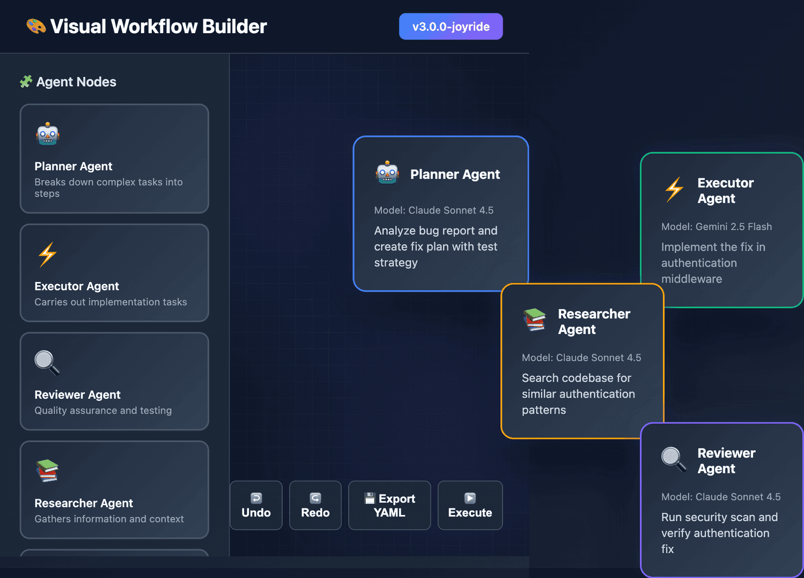
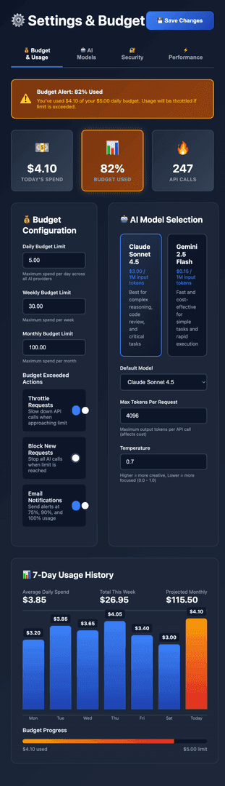

# Workflow Dashboard

AI workflow orchestration with visual builder, security scanning, and multi-model routing.

[GitHub](https://github.com/holburn-hornssentinel/workflow-dashboard)


## Features

- **Visual Workflow Builder** - Drag-and-drop interface with 2D/3D visualization
- **"Vibe Coding"** - Type natural language like "Create an email workflow" and AI generates the nodes
- **QA Test Agent** - Automated UI testing with Playwright + Gemini Vision AI validation
- **Security Scanner** - Real-time vulnerability detection (CWE-78, CWE-22, CWE-798) as you build
- **Multi-Model Router** - Routes simple tasks to Gemini Flash, complex reasoning to Claude Opus
- **Budget Enforcement** - Daily/weekly/monthly spending limits with automatic cutoffs
- **Permission System** - Human-in-the-loop approvals for high-risk operations
- **MCP Tools** - 75+ tools via Model Context Protocol (file system, Git, APIs, web)

## Screenshots

### Visual Workflow Builder

*Drag-and-drop canvas with 7 node types: Input, Output, AI Agent, API Call, Transform, Conditional, Loop*

### Security Scanner

*Real-time vulnerability detection with CWE references, severity ratings, and fix suggestions*

### Model Routing & Budget Control

*Multi-model routing with cost tracking and budget enforcement*

## Quick Start

**Requirements:** Node.js 18+ (22 recommended)

```bash
git clone https://github.com/holburn-hornssentinel/workflow-dashboard.git
cd workflow-dashboard
npm install
cp .env.example .env.local  # Configure API keys
npm run dev
```

Open http://localhost:3004

The UI works immediately. Add API keys via Settings when ready for AI features.

**Optional:** To use the QA test feature, build the Docker image:
```bash
docker build -f tests/Dockerfile.qa -t qa-agent tests/
```

## Why This Exists

I built this to solve problems I kept hitting when building AI workflows:

**Security blind spots** - Command injection, hardcoded API keys, and path traversal bugs slip through until production. The security scanner (`lib/suggestions/rules/security.ts`) catches these as you build, with CWE references and fix suggestions.

**Cost blowout** - Routing everything through expensive models burns budget fast. The multi-model router (`lib/ai/router.ts`) analyzes task complexity and routes:
- Simple tasks → Gemini Flash ($0.10/1M tokens)
- Moderate tasks → Claude Sonnet ($3/1M tokens)
- Complex reasoning → Claude Opus ($15/1M tokens)

**Permission chaos** - Dangerous operations (file writes, shell commands) need human approval. The permission system (`lib/mcp/client.ts`) gates risky operations with risk assessment before execution.

**What makes it different from Langflow/Flowise:**
- Security scanning is built into the builder (not a separate audit step)
- Multi-model routing with budget enforcement (not single-model)
- "Vibe Coding" generates workflows from natural language descriptions

## Configuration

Optional for testing. Configure via Settings UI or `.env.local`:

```env
ANTHROPIC_API_KEY=your_key_here
GEMINI_API_KEY=your_key_here
```

Get free API keys:
- [Anthropic Claude](https://console.anthropic.com/)
- [Google Gemini](https://aistudio.google.com/app/apikey)

## QA Test Agent

Automated UI testing with Playwright browser automation and Gemini Vision AI validation.

**Access:** Navigate to `/qa` in the dashboard

**Features:**
- 🧪 Real-time test streaming in browser
- 📸 Screenshot capture for visual regression
- 🤖 Optional AI-powered UI validation with Gemini Vision
- 🐳 Docker-based execution (isolated, reproducible)
- ✅ 88.9% automated test coverage

**Setup (Required):**

Build the QA Docker image (one-time setup):
```bash
docker build -f tests/Dockerfile.qa -t qa-agent tests/
```

**Run Tests:**

Via dashboard (easiest):
```bash
npm run build && npm start
# Open http://localhost:3004/qa
# Click "Run Tests"
```

Via Docker CLI (recommended for CI):
```bash
docker run --rm --network host -e HEADLESS=true qa-agent \
  python qa_agent.py --json --url http://localhost:3004
```

Via command line (requires Python setup):
```bash
# Install dependencies
pip3 install -r tests/requirements.txt
playwright install chromium

# Run tests
python3 tests/qa_agent.py --url http://localhost:3004
```

**Requirements:**
- Docker (required for dashboard QA feature)
- Optional: Gemini API key for AI validation

## Tech Stack

- **Frontend**: Next.js 16, React 19, TypeScript
- **UI**: React Flow (2D), Three.js (3D visualization)
- **AI**: Anthropic Claude API, Google Gemini API
- **Validation**: Zod schemas
- **Storage**: LanceDB (vector memory)
- **Tools**: Model Context Protocol (MCP)

## Project Structure

```
workflow-dashboard/
├── app/           # Next.js pages and API routes
├── components/    # React components (builder, security, router)
├── lib/           # Core libraries (AI, MCP, security, suggestions)
├── stores/        # State management (Zustand)
└── types/         # TypeScript definitions
```

## Commands

```bash
npm run dev        # Start development server (port 3004)
npm run build      # Build for production
npm start          # Run production build
npm run lint       # Run linter
```

## Documentation

- **[Getting Started Guide](docs/GETTING_STARTED.md)** - Build your first workflow in 5 minutes
- **[Workflow Builder](docs/WORKFLOW_BUILDER.md)** - Complete guide to nodes, connections, and patterns
- **[Configuration](docs/CONFIGURATION.md)** - API setup, MCP tools, and troubleshooting

## Contributing

Contributions welcome! Please open an issue first to discuss what you'd like to change.

See [SECURITY.md](SECURITY.md) for vulnerability reporting.

## License

[MIT](LICENSE)

## Development Status

This is an early-stage project shared for testing and feedback. You may encounter rough edges or bugs. Issue reports and contributions are appreciated!
